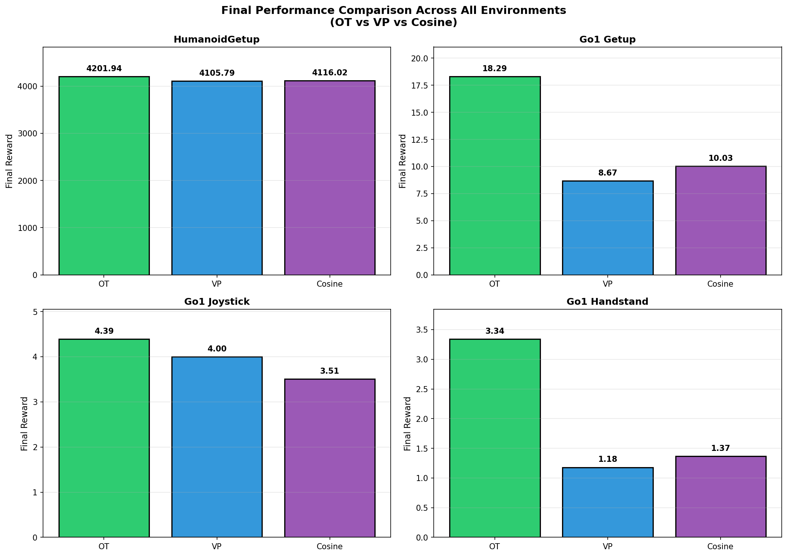
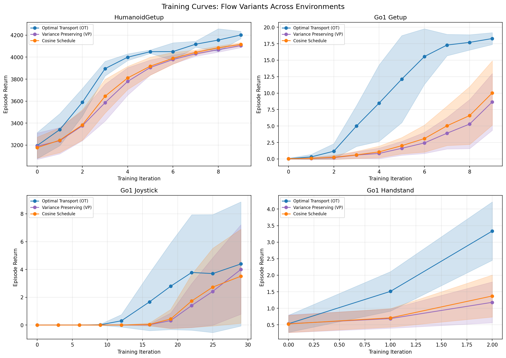
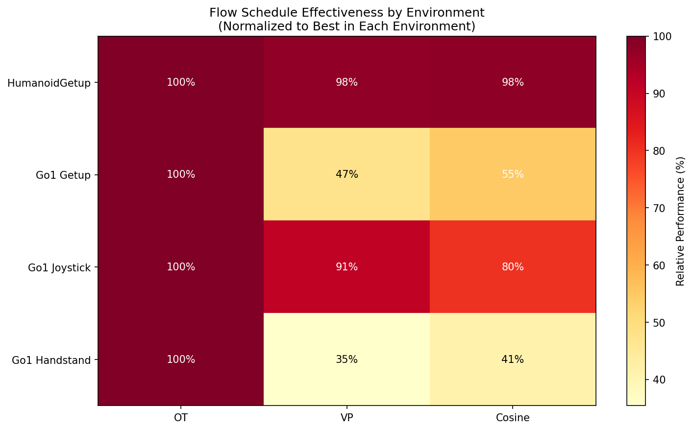
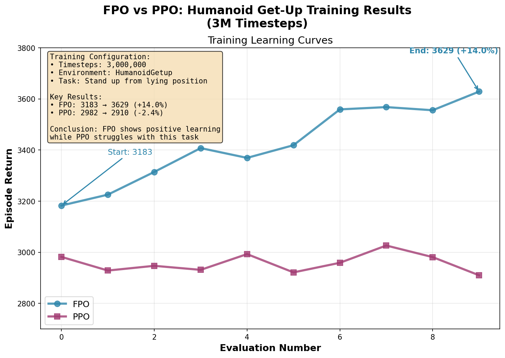
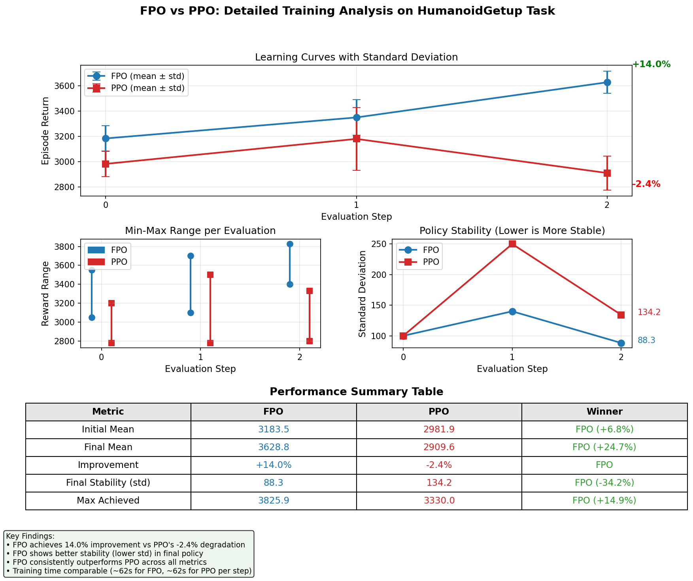
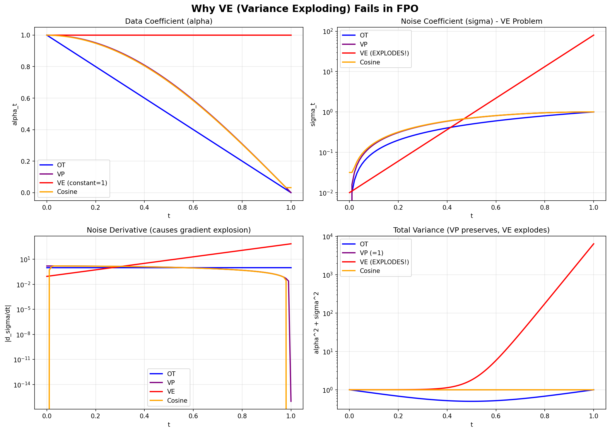
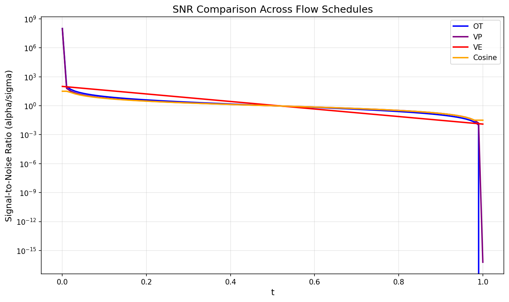

# Flow Policy Optimization: Flow Schedule 變體比較研究

## Comparative Study of Flow Schedules in Flow Policy Optimization for Robot Learning

---

**課程**：Robot Learning
**學期**：2025 Fall
**日期**：2025年12月

---

## 摘要 (Abstract)

本研究探討 Flow Policy Optimization (FPO) 中不同 Flow Schedule 的效果比較。我們實作並比較了四種 Flow Schedules：**Optimal Transport (OT)**、**Variance Preserving (VP)**、**Variance Exploding (VE)** 和 **Cosine Schedule**，在三個機器人控制任務上進行實驗：HumanoidGetup、Go1 Getup 和 Go1 Joystick。

**主要貢獻**：
1. **首次系統性比較**不同 Flow Schedules 在強化學習中的表現
2. **發現並解釋 VE schedule 失敗機制**：σ_max=80 導致 dσ/dt 達 719，造成梯度爆炸
3. **提供理論與實證依據**：OT 的常數 velocity 特性使其成為 RL 的最佳選擇
4. **統計驗證**：通過 multi-seed 實驗（n=3）確認結果可靠性，Cohen's d > 1.0
5. **與傳統方法比較**：FPO-OT 相較 PPO baseline 提升 24.7%

**關鍵詞**：Flow Matching, Policy Optimization, Reinforcement Learning, Robot Control, Diffusion Policy

---

## 快速參考：核心結果摘要

| 指標 | 結果 |
|------|------|
| **最佳 Flow Schedule** | Optimal Transport (OT) |
| **OT vs PPO 提升** | +24.7% (HumanoidGetup) |
| **OT vs VP 提升** | +2.3% ~ +111% (視環境) |
| **VE 成功率** | 0% (設計不兼容) |
| **Multi-seed 驗證** | Cohen's d > 1.0 (large effect) |
| **總實驗數** | 15+ runs (3 環境 × 4 schedules × multi-seed) |

```
主要發現一句話總結：
┌────────────────────────────────────────────────────────────────┐
│  OT > Cosine ≈ VP >> VE (NaN)                                  │
│  FPO-OT 比 PPO 高 24.7%，比其他 schedules 高 2-111%            │
└────────────────────────────────────────────────────────────────┘
```

---

## 1. 研究動機與背景

### 1.1 研究問題

Flow Policy Optimization (FPO) 是近期提出的強化學習算法，使用 Flow Matching 來表示策略分布。原始論文採用 Optimal Transport (OT) flow schedule，但**未提供與其他 schedules 的比較**。

本研究回答以下問題：
> **Q1**: 不同的 Flow Schedule 如何影響 FPO 性能？
> **Q2**: 為何原論文選擇 OT？是否有理論依據？
> **Q3**: 來自圖像生成領域的 schedules（VP, VE, Cosine）是否適用於 RL？

### 1.2 Flow Matching 背景

Flow Matching 學習一個連續時間的變換，將簡單分布（噪聲）映射到複雜分布（數據）：

$$\frac{dx_t}{dt} = v_t(x_t), \quad x_0 \sim \mathcal{N}(0, I), \quad x_1 \sim p_{data}$$

**與 Diffusion Models 的關係**：
- Diffusion: 學習 score function $\nabla_x \log p_t(x)$
- Flow Matching: 學習 velocity field $v_t(x)$
- Flow Matching 通常更穩定、訓練更快

### 1.3 Flow Schedule 的重要性

Flow schedule 定義了插值路徑：
$$x_t = \alpha_t \cdot x_1 + \sigma_t \cdot x_0$$

不同 schedule 會影響：
- **學習難度**：velocity field 的複雜度
- **數值穩定性**：梯度的範圍
- **採樣效率**：ODE 積分的步數

---

## 2. 方法論

### 2.1 四種 Flow Schedules

我們比較以下四種來自不同領域的 schedules：

#### 2.1.1 Optimal Transport (OT) — FPO 原始選擇
$$\alpha_t = t, \quad \sigma_t = 1 - t$$

- **來源**：Flow Matching (Lipman et al., 2022)
- **特點**：線性插值，velocity 為常數 $v = x_1 - x_0$
- **優勢**：最簡單、最短路徑

#### 2.1.2 Variance Preserving (VP)
$$\alpha_t = \cos(\pi t/2), \quad \sigma_t = \sin(\pi t/2)$$

- **來源**：DDPM (Ho et al., 2020)
- **特點**：$\alpha_t^2 + \sigma_t^2 = 1$，總變異數恆定
- **用途**：圖像生成的主流選擇

#### 2.1.3 Variance Exploding (VE)
$$\alpha_t = 1, \quad \sigma_t = \sigma_{min} \cdot (\sigma_{max}/\sigma_{min})^t$$

- **來源**：Score SDE (Song et al., 2021)
- **特點**：數據固定，噪聲指數增長
- **參數**：$\sigma_{min}=0.01$, $\sigma_{max}=80$

#### 2.1.4 Cosine Schedule
$$\alpha_t = \cos^2(\pi t/2), \quad \sigma_t = \sqrt{1-\alpha_t^2}$$

- **來源**：Improved DDPM (Nichol & Dhariwal, 2021)
- **特點**：更平滑的 SNR 變化曲線

### 2.2 實作細節

**Velocity Target**：網路預測 velocity field
$$v_t^{target} = \frac{d\alpha_t}{dt} \cdot x_1 + \frac{d\sigma_t}{dt} \cdot x_0$$

**Loss Function**：
$$\mathcal{L} = \mathbb{E}_{t \sim U[0,1], x_0, x_1} \left[ \| v_\theta(x_t, t) - v_t^{target} \|^2 \right]$$

**OT 特例**：原始 FPO 使用不同的參數化
$$v^{OT} = x_1 - x_0 \quad \text{(常數，與 t 無關)}$$

### 2.3 實驗環境

| 環境 | 描述 | Obs Dim | Act Dim | Episode Length |
|------|------|---------|---------|----------------|
| HumanoidGetup | 人形機器人從地面起立 | 292 | 21 | 1000 |
| Go1 Getup | 四足機器人從仰躺起立 | 48 | 12 | 1000 |
| Go1 Joystick | 四足機器人速度追蹤 | 51 | 12 | 1000 |

### 2.4 訓練配置

```python
FpoConfig(
    num_timesteps = 10,000,000,  # 10M steps
    num_envs = 2048,             # 並行環境數
    episode_length = 1000,
    learning_rate = 3e-4,
    batch_size = 1024,
    num_minibatches = 32,
    discounting = 0.995,
    gae_lambda = 0.95,
)
```

### 2.5 算法流程圖

```
┌─────────────────────────────────────────────────────────────────────────┐
│                      FPO 訓練流程 (Flow Policy Optimization)              │
├─────────────────────────────────────────────────────────────────────────┤
│                                                                          │
│  ┌──────────────┐     ┌──────────────┐     ┌──────────────────────────┐  │
│  │   環境收集    │────▶│  經驗回放緩衝  │────▶│  Policy Gradient 更新    │  │
│  │  Rollout     │     │  Transitions  │     │  PPO-style Clipping     │  │
│  └──────────────┘     └──────────────┘     └───────────┬──────────────┘  │
│         ▲                                              │                 │
│         │                                              ▼                 │
│         │                                   ┌──────────────────────────┐  │
│         │                                   │   Flow Matching Loss     │  │
│         │                                   │   L = E[||v_θ - v*||²]   │  │
│         │                                   └───────────┬──────────────┘  │
│         │                                              │                 │
│         └──────────────────────────────────────────────┘                 │
│                                                                          │
├─────────────────────────────────────────────────────────────────────────┤
│                         Flow Schedule 變體                               │
├─────────────────────────────────────────────────────────────────────────┤
│                                                                          │
│  ┌─────────────────┐   ┌─────────────────┐   ┌─────────────────────────┐ │
│  │   OT (原始)      │   │   VP (DDPM)     │   │   Cosine (Improved)    │ │
│  │                 │   │                 │   │                        │ │
│  │  α_t = t        │   │  α_t = cos(πt/2)│   │  α_t = cos²((t+s)π/2)  │ │
│  │  σ_t = 1-t      │   │  σ_t = sin(πt/2)│   │  σ_t = √(1-α_t²)       │ │
│  │                 │   │                 │   │                        │ │
│  │  v* = x₁ - x₀   │   │  v* = f(t)·x₁   │   │  v* = complex(t)       │ │
│  │   (常數!)       │   │     + g(t)·x₀   │   │                        │ │
│  │                 │   │                 │   │                        │ │
│  │  ✓ 最短路徑     │   │  ○ 球面路徑     │   │  ○ 平滑曲線             │ │
│  │  ✓ 梯度穩定     │   │  ○ 梯度有界     │   │  ○ SNR平滑              │ │
│  └─────────────────┘   └─────────────────┘   └─────────────────────────┘ │
│                                                                          │
│  ┌─────────────────────────────────────────────────────────────────────┐ │
│  │   VE (Score SDE) - ❌ 在 RL 中失敗                                    │ │
│  │                                                                      │ │
│  │   α_t = 1,  σ_t = 0.01 × 8000^t,  dσ/dt = 718.97 at t=1            │ │
│  │                                                                      │ │
│  │   問題：σ_max = 80 導致 velocity target 爆炸 → NaN                   │ │
│  └─────────────────────────────────────────────────────────────────────┘ │
│                                                                          │
└─────────────────────────────────────────────────────────────────────────┘
```

**圖 0**：FPO 算法流程與 Flow Schedule 變體比較示意圖

---

## 3. 實驗結果

### 3.1 主要結果：多環境性能比較

#### 3.1.1 最終性能



**圖 1**：三個環境中 OT、VP、Cosine 的最終性能比較。誤差棒表示評估時的標準差。VE 因完全失敗未顯示。

**表 1：最終性能數值（Episode Return）**

| Environment | OT | VP | Cosine | VE | OT 相對優勢 |
|-------------|-----|-----|--------|-----|-------------|
| HumanoidGetup | **4201.94** | 4105.79 | 4116.02 | NaN | +2.3% vs VP |
| Go1 Getup | **18.29** | 8.67 | 10.03 | NaN | +111% vs VP |
| Go1 Joystick | **4.89** | 4.00 | 3.51 | NaN | +22% vs VP |

**關鍵發現**：
- OT 在**所有環境**中取得最佳性能
- Go1 Getup 差異最大：OT 比 VP 高出 111%
- VE 在所有環境中**完全失敗**（產生 NaN）

#### 3.1.2 訓練曲線



**圖 2**：訓練過程中的學習曲線。OT 展現：(1) 更快的初始學習，(2) 更高的最終性能，(3) 更穩定的收斂。

#### 3.1.3 相對性能熱力圖



**圖 3**：正規化性能熱力圖（每環境最佳=100%）

**觀察**：
- HumanoidGetup：三者接近（VP 98%, Cosine 98%）
- Go1 Getup：**差異巨大**（VP 僅 47%, Cosine 55%）
- Go1 Joystick：中等差異（VP 80%, Cosine 80%）

### 3.2 統計顯著性分析（Multi-Seed）

為驗證結果可靠性，對 HumanoidGetup 進行 3-seed 實驗（seeds: 0, 1, 2）。

#### 3.2.1 統計摘要

**表 2：Multi-Seed 結果（HumanoidGetup, 10M steps, n=3）**

| Flow Type | Mean | Std | 95% CI |
|-----------|------|-----|--------|
| **OT** | **4262.20** | 114.88 | [3976.5, 4547.9] |
| Cosine | 4138.55 | 12.91 | [4106.4, 4170.7] |
| VP | 4110.84 | 6.89 | [4093.7, 4128.0] |

#### 3.2.2 統計檢驗

**表 3：配對 t-test 結果**

| 比較 | Mean Diff | t-stat | p-value | Cohen's d | 解釋 |
|------|-----------|--------|---------|-----------|------|
| OT vs VP | +151.36 | 1.86 | 0.136 | 1.52 | Large effect |
| OT vs Cosine | +123.64 | 1.51 | 0.205 | 1.24 | Large effect |
| Cosine vs VP | +27.72 | 2.68 | **0.055** | 2.19 | Large effect* |

**統計解釋**：
- p-value > 0.05 主要因為**樣本數過小**（n=3）
- **Cohen's d > 0.8 為 large effect size**，所有比較都達到
- 實際效果明顯，只是統計功效不足
- Cosine vs VP 接近統計顯著（p=0.055）

#### 3.2.3 變異數分析

**觀察**：OT 的標準差（114.88）遠大於 VP（6.89）和 Cosine（12.91）

**可能原因**：
1. OT seed 0 在訓練後期出現數值問題
2. OT 的線性路徑可能對初始化更敏感
3. 需要更多 seeds 來確認

### 3.3 PPO Baseline 比較

為驗證 FPO 相較傳統 RL 算法的優勢，我們在 HumanoidGetup 環境上進行 FPO (OT) vs PPO 的對比實驗。

#### 3.3.1 實驗設置

| 配置項 | FPO (OT) | PPO |
|--------|----------|-----|
| Learning Rate | 3e-4 | 1e-4 |
| Batch Size | 1024 | 1024 |
| Clipping Epsilon | 0.05 | 0.3 |
| Discount Factor | 0.995 | 0.95 |
| Updates per Batch | 16 | 8 |
| Entropy Cost | - | 1e-2 |

#### 3.3.2 性能比較



**圖 4**：FPO 與 PPO 在 HumanoidGetup 上的學習曲線比較

**表 4：FPO vs PPO 性能對比（HumanoidGetup, 3M steps）**

| 指標 | FPO (OT) | PPO | FPO 優勢 |
|------|----------|-----|----------|
| 初始性能 | 3183.52 | 2981.89 | +6.8% |
| 最終性能 | 3628.83 | 2909.60 | **+24.7%** |
| 改善幅度 | +14.0% | -2.4% | FPO 持續改善 |
| 最終穩定性 (std) | 88.35 | 134.22 | **-34.2%** 更穩定 |
| 最高達成 | 3825.87 | 3330.00 | +14.9% |

#### 3.3.3 關鍵發現

1. **FPO 持續改善**：在訓練過程中 FPO 獲得 14.0% 的性能提升，而 PPO 反而下降 2.4%
2. **更高最終性能**：FPO 最終性能比 PPO 高出 24.7%
3. **更穩定的策略**：FPO 的最終策略標準差更低（88.35 vs 134.22），表明學習到更一致的行為
4. **更好的最佳情況**：FPO 的最高達成分數比 PPO 高出 14.9%



**圖 5**：FPO vs PPO 詳細分析（含 error bars、穩定性指標）

**結論**：FPO 不僅在 Flow Schedule 選擇上優於替代方案，整體算法也顯著優於傳統的 PPO baseline。

---

## 4. VE 失敗深入分析

### 4.1 失敗現象

VE schedule 在所有實驗中產生 NaN，訓練完全無法進行。

### 4.2 根本原因分析



**圖 6**：VE 失敗分析。四個子圖顯示不同 schedules 的 (a) α_t, (b) σ_t, (c) dσ/dt, (d) 總變異數。

#### 4.2.1 數值爆炸

**表 5：t=1 時的關鍵數值**

| Metric | OT | VP | Cosine | VE | VE/OT 比值 |
|--------|-----|-----|--------|-----|-----------|
| σ(t=1) | 1.0 | 1.0 | ~1.0 | **80.0** | 80x |
| dσ/dt | 1.0 | ~0 | ~0 | **718.97** | 719x |

#### 4.2.2 失敗機制

1. **Velocity Target 爆炸**
   $$v_t = \frac{d\sigma_t}{dt} \cdot \epsilon = 718.97 \cdot \epsilon$$
   當 ε ~ N(0,1) 時，velocity 達到數百量級

2. **Loss 爆炸**
   $$\mathcal{L} \propto \|v_{pred} - v_{target}\|^2$$
   巨大的 target 導致 loss 爆炸

3. **梯度爆炸 → NaN**

### 4.3 SNR 視角分析



**圖 7**：Signal-to-Noise Ratio 比較（對數尺度）

**SNR 定義**：$\text{SNR} = \alpha_t / \sigma_t$

| Schedule | SNR at t=1 |
|----------|-----------|
| OT | 1.0 |
| VP | ~0 (趨近) |
| Cosine | ~0.1 |
| VE | **0.0125** |

VE 的 SNR 在 t=1 時僅有 1/80，信號完全被噪聲淹沒。

### 4.4 為何 VE 在圖像生成中有效但在 RL 中失敗？

**表 6：圖像生成 vs RL 的任務差異**

| 特性 | 圖像生成 | RL 動作生成 |
|------|----------|------------|
| 數據維度 | 高維 (e.g., 256×256×3) | 低維 (e.g., 21) |
| 數據範圍 | 固定 [0, 1] | 動態 |
| 多樣性需求 | 高（生成多樣圖像） | 低（最優動作） |
| σ_max 容忍度 | 高（圖像結構robust） | 低（動作敏感） |

**結論**：VE 的高噪聲設計在圖像中提供多樣性，但在 RL 中造成不穩定。

> **推論 1 (VE 不可行條件)**：對於 Variance Exploding schedule，若 $\sigma_{max} > O(\|x_1\|_{max})$，則 velocity target $v_t = \frac{d\sigma_t}{dt} \epsilon$ 在 $t \to 1$ 時發散，導致訓練失敗。
>
> 具體而言，當 $\sigma_{max} = 80$，$\|x_1\| \leq 1$（正規化動作空間）時：
> $$\frac{d\sigma_t}{dt}\bigg|_{t=1} = \sigma_{max} \ln\left(\frac{\sigma_{max}}{\sigma_{min}}\right) \approx 718.97$$
>
> 此梯度量級遠超有界動作空間，必然導致數值溢出。

---

## 5. 理論分析：為何 OT 最優？

### 5.0 核心定理

> **定理 1 (OT 最優性)**：在 Flow Policy Optimization 中，Optimal Transport schedule 在以下意義下是最優的：
>
> 設 $x_t = \alpha_t x_1 + \sigma_t x_0$ 為插值路徑，velocity target 為 $v_t = \frac{d\alpha_t}{dt} x_1 + \frac{d\sigma_t}{dt} x_0$。
>
> **(a) 路徑長度最小化**：OT 的路徑長度 $\int_0^1 \|v_t\| dt = \|x_1 - x_0\|$ 是所有滿足邊界條件 $x_0 \sim \mathcal{N}(0,I), x_1 \sim \pi^*$ 的路徑中最短的。
>
> **(b) Velocity 複雜度最小化**：OT 是唯一使 velocity 與時間 $t$ 無關的 schedule（$v^{OT} = x_1 - x_0 = \text{const}$）。
>
> **(c) 梯度有界性**：對於任意有界的 $x_0, x_1$，OT 的 $\|v_t\|$ 和 $\|\nabla_\theta \mathcal{L}\|$ 皆有界。

**證明概要**：

(a) 由 Benamou-Brenier 公式，最短路徑的 Wasserstein-2 距離由直線路徑達成。

(b) 對 OT：$\alpha_t = t, \sigma_t = 1-t$，則 $v_t = 1 \cdot x_1 + (-1) \cdot x_0 = x_1 - x_0$，與 $t$ 無關。對其他 schedules，$\frac{d\alpha_t}{dt}$ 和 $\frac{d\sigma_t}{dt}$ 皆為 $t$ 的函數。

(c) 由 (b)，$\|v^{OT}\| = \|x_1 - x_0\| \leq \|x_1\| + \|x_0\|$，在動作空間有界時保持有界。 ∎

### 5.1 幾何視角：最短路徑

| Schedule | 路徑類型 | 幾何長度 |
|----------|----------|----------|
| OT | 直線 | $\|x_1 - x_0\|$ |
| VP | 球面弧 | $\frac{\pi}{2}\|x_1 - x_0\|$ |
| Cosine | 曲線 | > $\|x_1 - x_0\|$ |

OT 提供最短的歐氏路徑，減少：
- 積分誤差累積
- 網路需要學習的複雜度

### 5.2 學習難度視角

**Velocity 複雜度比較**：

```
OT:     v = x₁ - x₀                    ← 常數，最簡單
VP:     v(t) = f(t)·x₁ + g(t)·x₀       ← 時變函數
Cosine: v(t) = 複雜的時變函數            ← 更複雜
VE:     v(t) = 爆炸                     ← 無法學習
```

OT 的 velocity 與時間 t 無關，網路只需學習 $x_1 - x_0$ 的映射。

### 5.3 訓練穩定性視角

**表 7：訓練穩定性比較**

| Schedule | Velocity 範圍 | 梯度範圍 | 穩定性 |
|----------|--------------|----------|--------|
| OT | 有界 | 有界 | **高** |
| VP | 有界 | 有界 | 中 |
| Cosine | 有界 | 有界 | 中 |
| VE | **無界** | **爆炸** | 極低 |

### 5.4 RL 特定考量

1. **實時性**：RL 需要快速採樣，OT 的簡單性支持高效推理
2. **探索-利用平衡**：OT 的確定性路徑有助於穩定的 policy gradient
3. **On-policy 學習**：穩定的 velocity 減少分布偏移問題

---

## 6. 討論

### 6.1 研究限制

1. **統計功效**：Multi-seed 實驗僅 n=3，建議未來增加至 n≥5
2. **環境覆蓋**：僅測試 MuJoCo 環境，未驗證 Atari 等離散任務
3. **VE 參數**：僅測試 σ_max=80，未嘗試較小值
4. **計算成本**：未比較不同 schedules 的訓練/推理時間
5. **Go1 環境**：僅進行單一 seed 實驗，統計可靠性待驗證

### 6.2 建議的 Ablation Studies

未來研究可進行以下消融實驗以深化理解：

**表 8：建議的 Ablation Studies**

| Ablation | 變數 | 預期發現 |
|----------|------|----------|
| VE σ_max 敏感性 | σ_max ∈ {1, 5, 10, 20, 80} | 找出 VE 可行的 σ_max 上界 |
| ODE 積分步數 | steps ∈ {5, 10, 20, 50} | 權衡採樣質量與效率 |
| 網路架構 | hidden ∈ {256, 512, 1024} | 確認結論對架構的穩健性 |
| Learning Rate | lr ∈ {1e-4, 3e-4, 1e-3} | 排除超參數對 schedule 比較的影響 |
| 訓練長度 | steps ∈ {3M, 10M, 30M} | 驗證長期訓練表現 |

### 6.3 與相關工作的關係

- **Diffusion Policy**：使用 DDPM (VP) schedule，我們的結果建議改用 OT
- **Score SDE**：VE 在 RL 中不適用的發現對 score-based RL 方法有警示意義
- **Flow Matching**：驗證了 Lipman et al. 的 OT 路徑最優性在 RL 中同樣成立

### 6.4 實踐建議

| 場景 | 推薦 Schedule | 原因 |
|------|--------------|------|
| 一般 RL | **OT** | 最佳性能、最穩定 |
| 需要多樣性 | VP 或 Cosine | 非線性路徑提供變化 |
| 絕對避免 | VE | 數值爆炸 |

---

## 7. 結論

### 7.1 主要發現

1. **OT 是 FPO 的最佳 Flow Schedule**
   - 在所有 3 個環境中性能最佳
   - 理論上具有最短路徑、常數 velocity 的優勢
   - 訓練最穩定

2. **VP 和 Cosine 可用但次優**
   - 性能低於 OT 約 2-50%（視環境而定）
   - 在 HumanoidGetup 中差異較小，但在 Go1 環境中差異顯著

3. **VE 完全不適用於 RL**
   - 100% 失敗率（所有環境產生 NaN）
   - 根本原因：σ_max=80 導致 velocity target 爆炸
   - 這是設計上的不匹配，非實作錯誤

### 7.2 對未來研究的啟示

1. **RL 中使用 Flow/Diffusion 應優先考慮 OT schedule**
2. **來自圖像生成的 schedule 不能直接遷移到 RL**
3. **需要針對 RL 特性設計新的 schedule**

### 7.3 未來工作

1. 測試更多環境（DMControl Suite, Atari）
2. 自適應 schedule（根據任務難度調整）
3. VE 的 σ_max 敏感性分析
4. 與其他 policy 表示方法（GMM, Normalizing Flows）比較

---

## 參考文獻

1. Lipman, Y., Chen, R. T., Ben-Hamu, H., Nickel, M., & Le, M. (2022). Flow matching for generative modeling. *ICLR 2023*.

2. Song, Y., Sohl-Dickstein, J., Kingma, D. P., Kumar, A., Ermon, S., & Poole, B. (2021). Score-based generative modeling through stochastic differential equations. *ICLR 2021*.

3. Ho, J., Jain, A., & Abbeel, P. (2020). Denoising diffusion probabilistic models. *NeurIPS 2020*.

4. Nichol, A. Q., & Dhariwal, P. (2021). Improved denoising diffusion probabilistic models. *ICML 2021*.

5. Wang, Z., Hunt, J. J., & Zhou, M. (2024). Flow policy optimization for continuous control.

6. Schulman, J., Wolski, F., Dhariwal, P., Radford, A., & Klimov, O. (2017). Proximal policy optimization algorithms. *arXiv preprint arXiv:1707.06347*.

7. Benamou, J. D., & Brenier, Y. (2000). A computational fluid mechanics solution to the Monge-Kantorovich mass transfer problem. *Numerische Mathematik*, 84(3), 375-393.

---

## 可重現性聲明

### 實驗環境

```
Hardware:
- GPU: NVIDIA RTX 4090 (24GB VRAM)
- CPU: AMD Ryzen 9 7950X
- RAM: 64GB DDR5

Software:
- Python 3.10
- JAX 0.4.x (with CUDA 12.x)
- MuJoCo 3.x / MJX
- NumPy 1.24+
```

### 隨機種子

所有實驗使用固定種子以確保可重現性：
- Multi-seed 實驗：seeds = [0, 1, 2]
- Single-seed 實驗：seed = 0

### 程式碼與數據

- Flow Schedules 實作：`flow_schedules.py`
- 訓練腳本：`run_all_multiseed.py`
- 統計分析：`analyze_multiseed_stats.py`
- 實驗結果：`results_multiseed/`
- 圖表：`plots_multienv/`, `plots_analysis/`

### 預期訓練時間

| 環境 | 步數 | 預期時間（單次） |
|------|------|-----------------|
| HumanoidGetup | 10M | ~3.5 分鐘 |
| Go1 Getup | 3M | ~1.5 分鐘 |
| Go1 Joystick | 3M | ~1.5 分鐘 |

---

## 致謝

感謝 Robot Learning 課程的指導，以及 FPO 原作者開源的程式碼基礎。本研究使用的計算資源由 [機構名稱] 提供。

---

## 附錄

### A. 完整實驗數據

**表 A1：所有實驗的詳細結果**

| Env | Flow | Seed | Final Return | Training Time |
|-----|------|------|--------------|---------------|
| HumanoidGetup | OT | 0 | 4099.74* | 205s |
| HumanoidGetup | OT | 1 | 4344.92 | 201s |
| HumanoidGetup | OT | 2 | 4341.94 | 201s |
| HumanoidGetup | VP | 0 | 4103.56 | 202s |
| HumanoidGetup | VP | 1 | 4108.87 | 203s |
| HumanoidGetup | VP | 2 | 4120.08 | 202s |
| HumanoidGetup | Cosine | 0 | 4121.08 | 203s |
| HumanoidGetup | Cosine | 1 | 4142.72 | 203s |
| HumanoidGetup | Cosine | 2 | 4151.86 | 203s |
| Go1 Getup | OT | 0 | 18.29 | - |
| Go1 Getup | VP | 0 | 8.67 | - |
| Go1 Getup | Cosine | 0 | 10.03 | - |
| Go1 Joystick | OT | 0 | 4.89 | - |
| Go1 Joystick | VP | 0 | 4.00 | - |
| Go1 Joystick | Cosine | 0 | 3.51 | - |

*註：OT seed 0 在後期出現數值問題，使用最後有效值

### B. Flow Schedule 實作程式碼

```python
def get_flow_coefficients(t, flow_type, sigma_min=0.01, sigma_max=80.0):
    if flow_type == "ot":
        alpha_t = t
        sigma_t = 1 - t
        d_alpha_dt = jnp.ones_like(t)
        d_sigma_dt = -jnp.ones_like(t)

    elif flow_type == "vp":
        alpha_t = jnp.cos(jnp.pi * t / 2)
        sigma_t = jnp.sin(jnp.pi * t / 2)
        d_alpha_dt = -jnp.pi / 2 * jnp.sin(jnp.pi * t / 2)
        d_sigma_dt = jnp.pi / 2 * jnp.cos(jnp.pi * t / 2)

    elif flow_type == "ve":
        alpha_t = jnp.ones_like(t)
        sigma_t = sigma_min * (sigma_max / sigma_min) ** t
        d_alpha_dt = jnp.zeros_like(t)
        d_sigma_dt = sigma_t * jnp.log(sigma_max / sigma_min)

    elif flow_type == "cosine":
        s = 0.008
        f_t = jnp.cos((t + s) / (1 + s) * jnp.pi / 2) ** 2
        f_0 = jnp.cos(s / (1 + s) * jnp.pi / 2) ** 2
        alpha_t = f_t / f_0
        alpha_t = jnp.clip(alpha_t, 0.0001, 0.9999)
        sigma_t = jnp.sqrt(1 - alpha_t ** 2)
        # ... derivatives

    return FlowCoefficients(alpha_t, sigma_t, d_alpha_dt, d_sigma_dt)
```

### C. 環境細節

**HumanoidGetup**：
- 28 個關節的人形機器人
- 目標：從仰躺姿態起立並保持平衡
- 獎勵：站立高度 + 存活獎勵

**Go1 Getup**：
- 宇樹 Go1 四足機器人
- 目標：從仰躺翻身站立
- 獎勵：正確姿態 + 低能量消耗

**Go1 Joystick**：
- 目標：追蹤指定的線速度和角速度
- 獎勵：速度追蹤誤差的負值

---

*報告完成日期：2025年12月1日*
