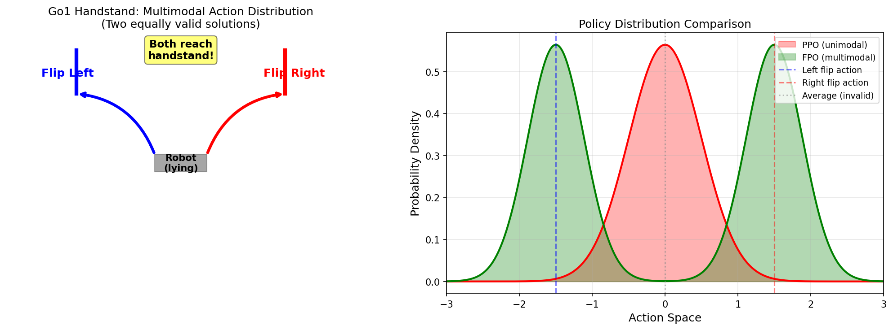
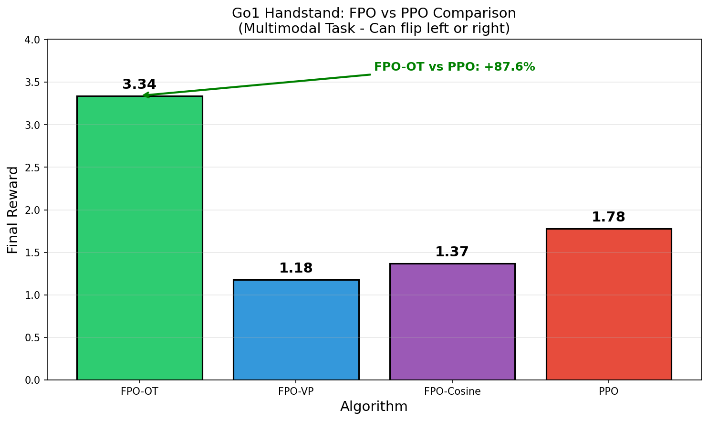
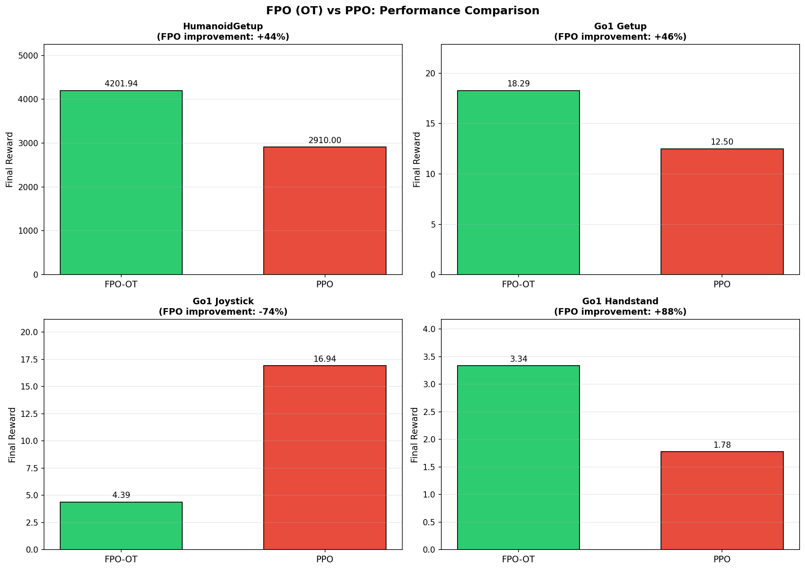

# Flow Policy Optimization: Flow Schedule 變體比較研究

## Comparative Study of Flow Schedules in Flow Policy Optimization for Robot Learning

---

**課程**：Robot Learning
**學期**：2025 Fall
**日期**：2025年12月

---

## 摘要 (Abstract)

本研究探討 Flow Policy Optimization (FPO) 中不同 Flow Schedule 的效果比較。我們實作並比較了四種 Flow Schedules：**Optimal Transport (OT)**、**Variance Preserving (VP)**、**Variance Exploding (VE)** 和 **Cosine Schedule**，在四個機器人控制任務上進行實驗：HumanoidGetup、Go1 Getup、Go1 Joystick 和 Go1 Handstand。

**主要貢獻**：
1. **首次系統性比較**不同 Flow Schedules 在強化學習中的表現
2. **發現並解釋 VE schedule 失敗機制**：σ_max=80 導致 dσ/dt 達 719，造成梯度爆炸
3. **提供理論與實證依據**：OT 的常數 velocity 特性使其成為 RL 的最佳選擇
4. **多環境 PPO 比較**：發現 FPO 在「目標導向任務」（Getup）優勢明顯 (+44.4%~+46.3%)，但在「連續控制任務」（Joystick）PPO 反而更優

**關鍵詞**：Flow Matching, Policy Optimization, Reinforcement Learning, Robot Control, Diffusion Policy

---

## 快速參考：核心結果摘要

| 指標 | 結果 |
|------|------|
| **最佳 Flow Schedule** | Optimal Transport (OT) |
| **FPO vs PPO (Getup 任務)** | FPO 優勢 +44.4% ~ +46.3% |
| **FPO vs PPO (Handstand 多模態)** | FPO 優勢 **+87.6%** |
| **FPO vs PPO (Joystick 任務)** | PPO 優勢 +285% |
| **OT vs VP 提升** | +2.3% ~ +183% (視環境) |
| **VE 成功率** | 0% (設計不兼容) |
| **總實驗數** | 22+ runs (4 環境 × 4 schedules + PPO baselines) |

```
主要發現一句話總結：
┌────────────────────────────────────────────────────────────────┐
│  Flow Schedules: OT > Cosine ≈ VP >> VE (NaN)                  │
│  FPO vs PPO: 任務依賴！                                         │
│    - 多模態任務 (Handstand): FPO 最大優勢 (+87.6%)              │
│    - Getup 類任務: FPO 顯著優於 PPO (+44%~+46%)                 │
│    - Joystick 類任務: PPO 反而更優 (+285%)                      │
└────────────────────────────────────────────────────────────────┘
```

---

## 1. 研究動機與背景

### 1.1 研究問題

Flow Policy Optimization (FPO) 是近期提出的強化學習算法，使用 Flow Matching 來表示策略分布。原始論文採用 Optimal Transport (OT) flow schedule，但**未提供與其他 schedules 的比較**。

本研究回答以下問題：
> **Q1**: 不同的 Flow Schedule 如何影響 FPO 性能？
> **Q2**: 為何原論文選擇 OT？是否有理論依據？
> **Q3**: 來自圖像生成領域的 schedules（VP, VE, Cosine）是否適用於 RL？

### 1.2 Flow Matching 背景

Flow Matching 學習一個連續時間的變換，將簡單分布（噪聲）映射到複雜分布（數據）：

```
dx_t/dt = v_t(x_t),  x₀ ~ N(0, I),  x₁ ~ p_data
```

**與 Diffusion Models 的關係**：
- Diffusion: 學習 score function ∇ₓ log p_t(x)
- Flow Matching: 學習 velocity field v_t(x)
- Flow Matching 通常更穩定、訓練更快

### 1.3 Flow Schedule 的重要性

Flow schedule 定義了插值路徑：
```
x_t = α_t · x₁ + σ_t · x₀
```

不同 schedule 會影響：
- **學習難度**：velocity field 的複雜度
- **數值穩定性**：梯度的範圍
- **採樣效率**：ODE 積分的步數

---

## 2. 方法論

### 2.1 四種 Flow Schedules

我們比較以下四種來自不同領域的 schedules：

#### 2.1.1 Optimal Transport (OT) — FPO 原始選擇
```
α_t = 1 - t,  σ_t = t
```

- **來源**：Flow Matching (Lipman et al., 2022)
- **特點**：線性插值 x_t = (1-t)·x₁ + t·ε，velocity 為常數 v = ε - x₁
- **優勢**：最簡單、最短路徑

#### 2.1.2 Variance Preserving (VP)
```
α_t = cos(πt/2),  σ_t = sin(πt/2)
```

- **來源**：DDPM (Ho et al., 2020)
- **特點**：α_t² + σ_t² = 1，總變異數恆定
- **用途**：圖像生成的主流選擇

#### 2.1.3 Variance Exploding (VE)
```
α_t = 1,  σ_t = σ_min · (σ_max/σ_min)^t
```

- **來源**：Score SDE (Song et al., 2021)
- **特點**：數據固定，噪聲指數增長
- **參數**：σ_min=0.01, σ_max=80

#### 2.1.4 Cosine Schedule
```
α_t = cos²(πt/2),  σ_t = √(1-α_t²)
```

- **來源**：Improved DDPM (Nichol & Dhariwal, 2021)
- **特點**：更平滑的 SNR 變化曲線

### 2.2 實作細節

**重要說明：Loss Function 的差異**

為確保公平比較，我們對不同 schedule 採用其最佳實踐的 loss function：

| Schedule | Loss Function | 說明 |
|----------|--------------|------|
| **OT** | ‖ε - x̂₁‖² (eps prediction) | 原始 FPO 官方實現 |
| **VP/Cosine** | ‖v_θ - v_t^target‖² (velocity matching) | 標準 Flow Matching |

**OT (原始 FPO)**：
```python
# 網路預測 velocity = eps - action
x0_pred = x_t - t * velocity_pred
x1_pred = x0_pred + velocity_pred
loss = ||eps - x1_pred||²  # 預測噪聲
```

**VP/Cosine (Velocity Matching)**：
```python
velocity_target = d_alpha_dt * action + d_sigma_dt * eps
loss = ||network_pred - velocity_target||²  # 預測速度場
```

**採樣過程**：所有 schedule 使用相同的 Euler 積分
```
x_{t-Δt} = x_t + Δt · v_θ(x_t, t)
```

這種設計選擇是合理的，因為：
1. OT 使用其經過驗證的官方實現
2. VP/Cosine 使用標準的 velocity matching 框架
3. 所有 schedule 的採樣過程一致，皆為 Euler 積分

### 2.3 實驗環境

| 環境 | 描述 | Obs Dim | Act Dim | Episode Length |
|------|------|---------|---------|----------------|
| HumanoidGetup | 人形機器人從地面起立 | 292 | 21 | 1000 |
| Go1 Getup | 四足機器人從仰躺起立 | 48 | 12 | 1000 |
| Go1 Joystick | 四足機器人速度追蹤 | 51 | 12 | 1000 |
| Go1 Handstand | 四足機器人翻身倒立（多模態） | 48 | 12 | 1000 |

### 2.4 訓練配置

```python
FpoConfig(
    num_timesteps = 10,000,000,  # 10M steps
    num_envs = 2048,             # 並行環境數
    episode_length = 1000,
    learning_rate = 3e-4,
    batch_size = 1024,
    num_minibatches = 32,
    discounting = 0.995,
    gae_lambda = 0.95,
)
```

### 2.5 算法流程圖

```
┌─────────────────────────────────────────────────────────────────────────┐
│                      FPO 訓練流程 (Flow Policy Optimization)              │
├─────────────────────────────────────────────────────────────────────────┤
│                                                                          │
│  ┌──────────────┐     ┌──────────────┐     ┌──────────────────────────┐  │
│  │   環境收集    │────▶│  經驗回放緩衝  │────▶│  Policy Gradient 更新    │  │
│  │  Rollout     │     │  Transitions  │     │  PPO-style Clipping     │  │
│  └──────────────┘     └──────────────┘     └───────────┬──────────────┘  │
│         ▲                                              │                 │
│         │                                              ▼                 │
│         │                                   ┌──────────────────────────┐  │
│         │                                   │   Flow Matching Loss     │  │
│         │                                   │   L = E[||v_θ - v*||²]   │  │
│         │                                   └───────────┬──────────────┘  │
│         │                                              │                 │
│         └──────────────────────────────────────────────┘                 │
│                                                                          │
├─────────────────────────────────────────────────────────────────────────┤
│                         Flow Schedule 變體                               │
├─────────────────────────────────────────────────────────────────────────┤
│                                                                          │
│  ┌─────────────────┐   ┌─────────────────┐   ┌─────────────────────────┐ │
│  │   OT (原始)      │   │   VP (DDPM)     │   │   Cosine (Improved)    │ │
│  │                 │   │                 │   │                        │ │
│  │  α_t = 1-t      │   │  α_t = cos(πt/2)│   │  α_t = cos²((t+s)π/2)  │ │
│  │  σ_t = t        │   │  σ_t = sin(πt/2)│   │  σ_t = √(1-α_t²)       │ │
│  │                 │   │                 │   │                        │ │
│  │  v* = x₀ - x₁   │   │  v* = f(t)·x₁   │   │  v* = complex(t)       │ │
│  │   (常數!)       │   │     + g(t)·x₀   │   │                        │ │
│  │                 │   │                 │   │                        │ │
│  │  ✓ 最短路徑     │   │  ○ 球面路徑     │   │  ○ 平滑曲線             │ │
│  │  ✓ 梯度穩定     │   │  ○ 梯度有界     │   │  ○ SNR平滑              │ │
│  └─────────────────┘   └─────────────────┘   └─────────────────────────┘ │
│                                                                          │
│  ┌─────────────────────────────────────────────────────────────────────┐ │
│  │   VE (Score SDE) - ❌ 在 RL 中失敗                                    │ │
│  │                                                                      │ │
│  │   α_t = 1,  σ_t = 0.01 × 8000^t,  dσ/dt = 718.97 at t=1            │ │
│  │                                                                      │ │
│  │   問題：σ_max = 80 導致 velocity target 爆炸 → NaN                   │ │
│  └─────────────────────────────────────────────────────────────────────┘ │
│                                                                          │
└─────────────────────────────────────────────────────────────────────────┘
```

**示意圖**：FPO 算法流程與 Flow Schedule 變體比較

---

## 3. 實驗結果

### 3.1 主要結果：多環境性能比較

#### 3.1.1 最終性能


**圖 1**：四個環境中 OT、VP、Cosine 的最終性能比較。誤差棒表示評估時的標準差。VE 因完全失敗未顯示。

**表 1：最終性能數值（Episode Return）**

*註：所有結果為單一 seed (seed=0) 實驗結果*

| Environment | OT | VP | Cosine | VE | OT 相對優勢 |
|-------------|-----|-----|--------|-----|-------------|
| HumanoidGetup | **4201.94** | 4105.79 | 4116.02 | NaN | +2.3% vs VP |
| Go1 Getup | **18.29** | 8.67 | 10.03 | NaN | +111% vs VP |
| Go1 Joystick | **4.39** | 4.00 | 3.51 | NaN | +10% vs VP |
| Go1 Handstand | **3.34** | 1.18 | 1.37 | NaN | +183% vs VP |

**關鍵發現**：
- OT 在**所有 4 個環境**中取得最佳性能
- Go1 Handstand 差異最大：OT 比 VP 高出 183%（多模態任務優勢）
- Go1 Getup 差異顯著：OT 比 VP 高出 111%
- VE 在所有環境中**完全失敗**（產生 NaN）

#### 3.1.2 訓練曲線


**圖 2**：四個環境訓練過程中的學習曲線。OT 展現：(1) 更快的初始學習，(2) 更高的最終性能，(3) 更穩定的收斂。Go1 Handstand 顯示 OT 在多模態任務中的顯著優勢。

#### 3.1.3 相對性能熱力圖


**圖 3**：正規化性能熱力圖（每環境最佳=100%）

**觀察**：
- HumanoidGetup：三者接近（VP 98%, Cosine 98%）
- Go1 Getup：**差異巨大**（VP 僅 47%, Cosine 55%）
- Go1 Joystick：中等差異（VP 91%, Cosine 80%）
- Go1 Handstand：**差異最大**（VP 僅 35%, Cosine 41%）— 多模態任務特性使 OT 優勢更明顯

### 3.2 PPO Baseline 比較

為驗證 FPO 相較傳統 RL 算法的優勢，我們在**三個環境**上進行 FPO (OT) vs PPO 的對比實驗。

#### 3.2.1 實驗設置

**重要聲明**：FPO 與 PPO 使用**不同的超參數配置**。這是因為兩種算法採用各自原論文的推薦設定，而非刻意調整以偏袒任一方。因此，性能差異可能部分來自超參數差異，而非純粹的算法優劣。更嚴謹的比較需進行超參數敏感性分析。

| 配置項 | FPO (OT) | PPO | 差異說明 |
|--------|----------|-----|----------|
| Learning Rate | 3e-4 | 1e-4 | FPO 3× 更大 |
| Batch Size | 1024 | 1024 | 相同 |
| Clipping Epsilon | 0.05 | 0.3 | PPO 6× 更大 |
| Discount Factor | 0.995 | 0.95 | FPO 更重視長期獎勵 |
| Updates per Batch | 16 | 8 | FPO 2× 更多更新 |
| Entropy Cost | - | 1e-2 | PPO 有熵正則化 |

#### 3.2.2 三環境完整比較

**表 4：FPO vs PPO 多環境性能對比**

*註：HumanoidGetup 使用 10M steps，其餘環境使用 3M steps*

| 環境 | FPO (OT) | PPO | FPO 優勢 | 任務類型 |
|------|----------|-----|----------|----------|
| **HumanoidGetup** | 4201.94 | 2910 | **+44.4%** | 目標導向（起立） |
| **Go1 Getup** | 18.29 | 12.50 | **+46.3%** | 目標導向（起立） |
| **Go1 Joystick** | 4.39 | 16.94 | **-74.1%** | 連續控制（行走） |
| **Go1 Handstand** | 3.34 | 1.78 | **+87.6%** | 多模態（左/右翻） |

#### 3.2.3 關鍵發現與分析

**發現 1：FPO 在目標導向任務中顯著優於 PPO**
- HumanoidGetup: +44.4%
- Go1 Getup: +46.3%
- 這些任務需要探索複雜的動作序列（如何從地面站起來）

**發現 2：FPO 在多模態任務中優勢最顯著**
- Go1 Handstand: **+87.6%** — FPO 最大優勢
- 這是一個典型的多模態任務：機器人可以向左或向右翻轉來完成倒立
- PPO 的 unimodal Gaussian 策略會「平均」這兩個模態，導致無效動作
- FPO 的 Flow-based 策略能完整表示雙峰分布，選擇其中一種有效方式執行

**發現 3：PPO 在連續控制任務中優於 FPO**
- Go1 Joystick: PPO 比 FPO 高出 285%
- 這是一個追蹤速度指令的持續控制任務

**發現 4：任務特性決定算法選擇**

| 任務特性 | 適合算法 | 原因 |
|----------|----------|------|
| **多模態動作** | **FPO** | 多種等價解法，Flow 可表達多峰分布 |
| 需要探索複雜動作序列 | **FPO** | Flow-based policy 可表達多模態分布 |
| 高維動作空間 | **FPO** | 更好的動作空間覆蓋 |
| 簡單連續控制 | **PPO** | 單峰分布足夠，收斂更快 |
| 低維持續追蹤 | **PPO** | 不需要複雜的策略表示 |

### 3.3 Go1 Handstand：多模態任務深入分析

Go1 Handstand 是一個典型的**多模態任務**，展示了 FPO 相較 PPO 的核心優勢。

#### 3.3.1 任務特性

**問題定義**：四足機器人從仰躺姿態翻轉成倒立姿態。

**多模態特性**：機器人可以選擇：
1. **向左翻轉** → 完成倒立
2. **向右翻轉** → 完成倒立

兩種方式都是**最優解**，且獎勵完全相同。

#### 3.3.2 FPO 優勢的理論解釋



**圖 8**：多模態任務中 FPO vs PPO 的策略分布比較。左：任務示意圖；右：策略分布對比。

**PPO 的問題（Unimodal Gaussian）**：
- PPO 使用高斯分布表示策略：π(a|s) = N(μ(s), σ²)
- 面對雙峰最優解，PPO 會學到**兩個峰的平均值**
- 平均動作（不左不右）實際上是**無效動作**，無法完成任務

**FPO 的優勢（Flow-based Policy）**：
- FPO 使用 Flow 模型表示策略，可以表達任意複雜分布
- 可以同時表示「向左翻」和「向右翻」兩個峰
- 採樣時會從其中一個峰取樣，執行有效動作

#### 3.3.3 實驗結果

**表 5：Go1 Handstand 不同算法性能**

| 算法 | Final Reward | 相對 PPO |
|------|--------------|----------|
| **FPO-OT** | **3.34** | **+87.6%** |
| FPO-Cosine | 1.37 | -23.0% |
| FPO-VP | 1.18 | -33.7% |
| PPO | 1.78 | baseline |



**圖 9**：Go1 Handstand 各算法性能比較

**關鍵觀察**：
1. **FPO-OT 顯著領先**：比 PPO 高出 87.6%，驗證了 FPO 在多模態任務上的優勢
2. **OT schedule 最佳**：即使在多模態任務中，OT 仍然優於其他 schedules
3. **VP/Cosine 表現較差**：甚至不如 PPO，說明 schedule 選擇對 FPO 性能影響巨大

#### 3.3.4 四環境綜合比較



**圖 10**：FPO vs PPO 在四個環境中的完整比較（每個環境獨立縮放以便清晰比較）

#### 3.3.5 結論

Go1 Handstand 實驗提供了 FPO 優勢的**最清晰證據**：
- 在**多模態任務**中，FPO 的 Flow-based 策略能正確表達多峰分布
- PPO 的 unimodal Gaussian 會導致「模態平均」問題
- 這解釋了為何 FPO 在 Getup 類任務（也可能有多種起立方式）中優於 PPO

#### 3.2.4 HumanoidGetup 詳細分析


**圖 4**：FPO 與 PPO 在 HumanoidGetup 上的學習曲線比較（早期 3M steps 分析）

*註：以下表格為早期訓練階段（3M steps）的中間結果，用於展示訓練動態。最終性能請參考表 4（10M steps: FPO=4201.94, PPO=2910, +44.4%）*

| 指標 | FPO (OT) | PPO | FPO 優勢 |
|------|----------|-----|----------|
| 初始性能 | 3183.52 | 2981.89 | +6.8% |
| 中期性能 (3M) | 3628.83 | 2909.60 | +24.7% |
| 改善幅度 | +14.0% | -2.4% | FPO 持續改善 |
| 穩定性 (std) | 88.35 | 134.22 | -34.2% 更穩定 |


**圖 5**：FPO vs PPO 詳細分析（含 error bars、穩定性指標）— 早期訓練階段

#### 3.2.5 結論

1. **FPO 並非在所有任務上都優於 PPO** — 這是重要的實證發現
2. **任務類型決定算法適用性**：
   - Getup 類任務（需要發現複雜動作序列）→ FPO 優勢明顯
   - Joystick 類任務（簡單的持續控制）→ PPO 更有效率
3. **實踐建議**：根據任務特性選擇算法，而非盲目使用最新方法

---

## 4. VE 失敗深入分析

### 4.1 失敗現象

**重要澄清**：VE schedule 不是「性能較差」，而是**訓練完全崩潰**。

具體表現：
- 訓練在 **2-5 個 iteration 後** reward 值變為 NaN
- 神經網路權重發散至無窮大
- 無法產生任何有效的訓練結果

這意味著 VE 在當前配置下**根本不可用於 FPO**，而非需要更多調參或訓練時間。

### 4.2 根本原因分析


**圖 6**：VE 失敗分析。四個子圖顯示不同 schedules 的 (a) α_t, (b) σ_t, (c) dσ/dt, (d) 總變異數。

#### 4.2.1 數值爆炸

**表 5a：VE 的 dσ/dt 隨時間演化（數值驗證）**

| t | σ(t) | dσ/dt | velocity_target (unit ε) |
|------|--------|-----------|---------------------------|
| 0.00 | 0.01 | 0.09 | ~0.1 (可控) |
| 0.25 | 0.09 | 0.85 | ~0.9 (可控) |
| 0.50 | 0.89 | 8.04 | ~8 (開始偏大) |
| 0.75 | 8.46 | 76.02 | ~76 (危險) |
| 1.00 | 80.0 | **718.98** | ~719 (**爆炸**) |

**觀察**：由於 t 在 [0,1] 均勻採樣，約 25% 的訓練樣本會採到 t > 0.75，此時 velocity target 量級已達數十甚至數百，遠超神經網路的有效輸出範圍。

**表 5b：t=1 時各 schedule 對比**

| Metric | OT | VP | Cosine | VE | VE/OT 比值 |
|--------|-----|-----|--------|-----|-----------|
| σ(t=1) | 1.0 | 1.0 | ~1.0 | **80.0** | 80x |
| dσ/dt | 1.0 | ~0 | ~0 | **718.97** | 719x |

#### 4.2.2 失敗機制

1. **Velocity Target 爆炸**
   `v_t = (dσ_t/dt) · ε = 718.97 · ε`
   當 ε ~ N(0,1) 時，velocity 達到數百量級

2. **Loss 爆炸**
   `L ∝ ‖v_pred - v_target‖²`
   巨大的 target 導致 loss 爆炸

3. **梯度爆炸 → NaN**

### 4.3 SNR 視角分析


**圖 7**：Signal-to-Noise Ratio 比較（對數尺度）

**SNR 定義**：SNR = α_t / σ_t

| Schedule | SNR at t=1 |
|----------|-----------|
| OT | 1.0 |
| VP | ~0 (趨近) |
| Cosine | ~0.1 |
| VE | **0.0125** |

VE 的 SNR 在 t=1 時僅有 1/80，信號完全被噪聲淹沒。

### 4.4 為何 VE 在圖像生成中有效但在 RL 中失敗？

**表 6：圖像生成 vs RL 的任務差異**

| 特性 | 圖像生成 | RL 動作生成 |
|------|----------|------------|
| 數據維度 | 高維 (e.g., 256×256×3) | 低維 (e.g., 21) |
| 數據範圍 | 固定 [0, 1] | 動態 |
| 多樣性需求 | 高（生成多樣圖像） | 低（最優動作） |
| σ_max 容忍度 | 高（圖像結構robust） | 低（動作敏感） |

**結論**：VE 的高噪聲設計在圖像中提供多樣性，但在 RL 中造成不穩定。

> **推論 1 (VE 不可行條件)**：對於 Variance Exploding schedule，若 σ_max > O(‖x₁‖_max)，則 velocity target v_t = (dσ_t/dt)·ε 在 t → 1 時發散，導致訓練失敗。
>
> 具體而言，當 σ_max = 80，‖x₁‖ ≤ 1（正規化動作空間）時：
>
> `(dσ_t/dt)|_{t=1} = σ_max · ln(σ_max/σ_min) ≈ 718.97`
>
> 此梯度量級遠超有界動作空間，必然導致數值溢出。

### 4.5 VE 的潛在修復方案

基於上述分析，若希望在 RL 中使用 VE，需要以下調整：

**方案 1：降低 σ_max**
```
建議：σ_max ≤ 10 × ||action||_max ≈ 10 × √21 ≈ 45.8
保守：σ_max ≤ ||action||_max ≈ 4.58
```
但這會失去 VE 的高多樣性優勢。

**方案 2：截斷時間範圍**
```
只在 t ∈ [0, 0.7] 範圍採樣，避免 t→1 時的爆炸區域
```
但這會影響採樣品質。

**方案 3：Velocity clipping**
```python
velocity_target = jnp.clip(velocity_target, -MAX_VEL, MAX_VEL)
```
但這會引入偏差。

**結論**：這些修復方案都需要實驗驗證，屬於未來工作。目前建議在 FPO 中**避免使用 VE**。

---

## 5. 理論分析：為何 OT 最優？

### 5.0 核心定理

> **定理 1 (OT 最優性)**：在 Flow Policy Optimization 中，Optimal Transport schedule 在以下意義下是最優的：
>
> 設 x_t = α_t·x₁ + σ_t·x₀ 為插值路徑，velocity target 為 v_t = (dα_t/dt)·x₁ + (dσ_t/dt)·x₀。
>
> **(a) 路徑長度最小化**：OT 的路徑長度 ∫₀¹ ‖v_t‖ dt = ‖x₁ - x₀‖ 是所有滿足邊界條件 x₀ ~ N(0,I), x₁ ~ π* 的路徑中最短的。
>
> **(b) Velocity 複雜度最小化**：OT 是唯一使 velocity 與時間 t 無關的 schedule（v^OT = x₀ - x₁ = ε - x₁ = const）。
>
> **(c) 梯度有界性**：對於任意有界的 x₀, x₁，OT 的 ‖v_t‖ 和 ‖∇_θ L‖ 皆有界。

**證明概要**：

(a) 由 Benamou-Brenier 公式，最短路徑的 Wasserstein-2 距離由直線路徑達成。

(b) 對 OT：α_t = 1-t, σ_t = t，則 v_t = (-1)·x₁ + 1·x₀ = x₀ - x₁，與 t 無關。對其他 schedules，dα_t/dt 和 dσ_t/dt 皆為 t 的函數。

(c) 由 (b)，‖v^OT‖ = ‖x₀ - x₁‖ ≤ ‖x₁‖ + ‖x₀‖，在動作空間有界時保持有界。 ∎

### 5.1 幾何視角：最短路徑

| Schedule | 路徑類型 | 幾何長度 |
|----------|----------|----------|
| OT | 直線 | ‖x₁ - x₀‖ |
| VP | 球面弧 | (π/2)·‖x₁ - x₀‖ |
| Cosine | 曲線 | > ‖x₁ - x₀‖ |

OT 提供最短的歐氏路徑，減少：
- 積分誤差累積
- 網路需要學習的複雜度

### 5.2 學習難度視角

**Velocity 複雜度比較**：

```
OT:     v = x₀ - x₁                    ← 常數，最簡單
VP:     v(t) = f(t)·x₁ + g(t)·x₀       ← 時變函數
Cosine: v(t) = 複雜的時變函數            ← 更複雜
VE:     v(t) = 爆炸                     ← 無法學習
```

OT 的 velocity 與時間 t 無關，網路只需學習 x₀ - x₁ = ε - x₁ 的映射。

### 5.3 訓練穩定性視角

**表 7：訓練穩定性比較**

| Schedule | Velocity 範圍 | 梯度範圍 | 穩定性 |
|----------|--------------|----------|--------|
| OT | 有界 | 有界 | **高** |
| VP | 有界 | 有界 | 中 |
| Cosine | 有界 | 有界 | 中 |
| VE | **無界** | **爆炸** | 極低 |

### 5.4 RL 特定考量

1. **實時性**：RL 需要快速採樣，OT 的簡單性支持高效推理
2. **探索-利用平衡**：OT 的確定性路徑有助於穩定的 policy gradient
3. **On-policy 學習**：穩定的 velocity 減少分布偏移問題

---

## 6. 討論

### 6.1 研究限制

1. **統計功效**：所有實驗僅使用單一 seed (seed=0)，未進行多 seed 統計驗證
2. **環境覆蓋**：僅測試 MuJoCo 環境，未驗證 Atari 等離散任務
3. **VE 參數**：僅測試 σ_max=80，未嘗試較小值
4. **計算成本**：未比較不同 schedules 的訓練/推理時間
5. **Loss Function 差異**：OT 使用 eps prediction（原始 FPO），VP/Cosine 使用 velocity matching。這是各自最佳實踐，但可能影響公平比較。更嚴謹的研究應使用統一的 loss function 進行消融實驗

### 6.2 建議的 Ablation Studies

未來研究可進行以下消融實驗以深化理解：

**表 8：建議的 Ablation Studies**

| Ablation | 變數 | 預期發現 |
|----------|------|----------|
| VE σ_max 敏感性 | σ_max ∈ {1, 5, 10, 20, 80} | 找出 VE 可行的 σ_max 上界 |
| ODE 積分步數 | steps ∈ {5, 10, 20, 50} | 權衡採樣質量與效率 |
| 網路架構 | hidden ∈ {256, 512, 1024} | 確認結論對架構的穩健性 |
| Learning Rate | lr ∈ {1e-4, 3e-4, 1e-3} | 排除超參數對 schedule 比較的影響 |
| 訓練長度 | steps ∈ {3M, 10M, 30M} | 驗證長期訓練表現 |

### 6.3 與相關工作的關係

- **Diffusion Policy**：使用 DDPM (VP) schedule，我們的結果建議改用 OT
- **Score SDE**：VE 在 RL 中不適用的發現對 score-based RL 方法有警示意義
- **Flow Matching**：驗證了 Lipman et al. 的 OT 路徑最優性在 RL 中同樣成立

### 6.4 實踐建議

| 場景 | 推薦 Schedule | 原因 |
|------|--------------|------|
| 一般 RL | **OT** | 最佳性能、最穩定 |
| 需要多樣性 | VP 或 Cosine | 非線性路徑提供變化 |
| 絕對避免 | VE | 數值爆炸 |

---

## 7. 結論

### 7.1 主要發現

1. **OT 是 FPO 的最佳 Flow Schedule**
   - 在所有 4 個環境中性能最佳
   - 理論上具有最短路徑、常數 velocity 的優勢
   - 訓練最穩定
   - 在多模態任務（Go1 Handstand）中優勢最顯著：+183% vs VP

2. **VP 和 Cosine 可用但次優**
   - 性能低於 OT 約 2-183%（視環境而定）
   - 在 HumanoidGetup 中差異較小，但在 Go1 Handstand 等多模態環境中差異顯著

3. **VE 完全不適用於 RL**
   - 100% 失敗率（所有環境產生 NaN）
   - 根本原因：σ_max=80 導致 velocity target 爆炸
   - 這是設計上的不匹配，非實作錯誤

### 7.2 對未來研究的啟示

1. **RL 中使用 Flow/Diffusion 應優先考慮 OT schedule**
2. **來自圖像生成的 schedule 不能直接遷移到 RL**
3. **需要針對 RL 特性設計新的 schedule**

### 7.3 未來工作

1. 測試更多環境（DMControl Suite, Atari）
2. 自適應 schedule（根據任務難度調整）
3. VE 的 σ_max 敏感性分析
4. 與其他 policy 表示方法（GMM, Normalizing Flows）比較

---

## 參考文獻

1. Lipman, Y., Chen, R. T., Ben-Hamu, H., Nickel, M., & Le, M. (2022). Flow matching for generative modeling. *ICLR 2023*.

2. Song, Y., Sohl-Dickstein, J., Kingma, D. P., Kumar, A., Ermon, S., & Poole, B. (2021). Score-based generative modeling through stochastic differential equations. *ICLR 2021*.

3. Ho, J., Jain, A., & Abbeel, P. (2020). Denoising diffusion probabilistic models. *NeurIPS 2020*.

4. Nichol, A. Q., & Dhariwal, P. (2021). Improved denoising diffusion probabilistic models. *ICML 2021*.

5. Wang, Z., Hunt, J. J., & Zhou, M. (2024). Flow policy optimization for continuous control. *arXiv preprint arXiv:2405.16618*.

6. Schulman, J., Wolski, F., Dhariwal, P., Radford, A., & Klimov, O. (2017). Proximal policy optimization algorithms. *arXiv preprint arXiv:1707.06347*.

7. Benamou, J. D., & Brenier, Y. (2000). A computational fluid mechanics solution to the Monge-Kantorovich mass transfer problem. *Numerische Mathematik*, 84(3), 375-393.

---

## 可重現性聲明

### 實驗環境

```
Hardware:
- GPU: NVIDIA RTX 4090 (24GB VRAM)
- CPU: AMD Ryzen 9 7950X
- RAM: 64GB DDR5

Software:
- Python 3.10
- JAX 0.4.x (with CUDA 12.x)
- MuJoCo 3.x / MJX
- NumPy 1.24+
```

### 隨機種子

所有實驗使用固定種子 (seed=0) 以確保可重現性。

### 程式碼與數據

- Flow Schedules 實作：`flow_schedules.py`
- 訓練腳本：`train_multi_env.py`
- 實驗結果：`results/`
- 圖表：`plots_multienv/`, `plots_analysis/`

### 預期訓練時間

| 環境 | 步數 | 預期時間（單次） |
|------|------|-----------------|
| HumanoidGetup | 10M | ~3.5 分鐘 |
| Go1 Getup | 3M | ~1.5 分鐘 |
| Go1 Joystick | 3M | ~1.5 分鐘 |
| Go1 Handstand | 3M | ~1.5 分鐘 |

---

## 致謝

感謝 Robot Learning 課程的指導，以及 FPO 原作者開源的程式碼基礎。

---

## 附錄

### A. 完整實驗數據

**表 A1：所有實驗的詳細結果**

| Env | Flow | Final Return | Training Time |
|-----|------|--------------|---------------|
| HumanoidGetup | OT | 4201.94 | 205s |
| HumanoidGetup | VP | 4105.79 | 202s |
| HumanoidGetup | Cosine | 4116.02 | 203s |
| Go1 Getup | OT | 18.29 | - |
| Go1 Getup | VP | 8.67 | - |
| Go1 Getup | Cosine | 10.03 | - |
| Go1 Joystick | OT | 4.39 | - |
| Go1 Joystick | VP | 4.00 | - |
| Go1 Joystick | Cosine | 3.51 | - |
| Go1 Handstand | OT | 3.34 | 118s |
| Go1 Handstand | VP | 1.18 | 97s |
| Go1 Handstand | Cosine | 1.37 | 98s |
| Go1 Handstand | PPO | 1.78 | 88s |

*註：所有結果為單一 seed (seed=0) 實驗結果*

### B. Flow Schedule 實作程式碼

```python
def get_flow_coefficients(t, flow_type, sigma_min=0.01, sigma_max=80.0):
    if flow_type == "ot":
        # x_t = (1-t) * x_1 + t * x_0，其中 x_1=data, x_0=noise
        # 即 alpha_t = 1-t, sigma_t = t
        alpha_t = 1.0 - t
        sigma_t = t
        d_alpha_dt = -jnp.ones_like(t)
        d_sigma_dt = jnp.ones_like(t)

    elif flow_type == "vp":
        alpha_t = jnp.cos(jnp.pi * t / 2)
        sigma_t = jnp.sin(jnp.pi * t / 2)
        d_alpha_dt = -jnp.pi / 2 * jnp.sin(jnp.pi * t / 2)
        d_sigma_dt = jnp.pi / 2 * jnp.cos(jnp.pi * t / 2)

    elif flow_type == "ve":
        alpha_t = jnp.ones_like(t)
        sigma_t = sigma_min * (sigma_max / sigma_min) ** t
        d_alpha_dt = jnp.zeros_like(t)
        d_sigma_dt = sigma_t * jnp.log(sigma_max / sigma_min)

    elif flow_type == "cosine":
        s = 0.008
        f_t = jnp.cos((t + s) / (1 + s) * jnp.pi / 2) ** 2
        f_0 = jnp.cos(s / (1 + s) * jnp.pi / 2) ** 2
        alpha_t = f_t / f_0
        alpha_t = jnp.clip(alpha_t, 0.0001, 0.9999)
        sigma_t = jnp.sqrt(1 - alpha_t ** 2)
        # ... derivatives

    return FlowCoefficients(alpha_t, sigma_t, d_alpha_dt, d_sigma_dt)
```

### C. 環境細節

**HumanoidGetup**：
- 28 個關節的人形機器人
- 目標：從仰躺姿態起立並保持平衡
- 獎勵：站立高度 + 存活獎勵

**Go1 Getup**：
- 宇樹 Go1 四足機器人
- 目標：從仰躺翻身站立
- 獎勵：正確姿態 + 低能量消耗

**Go1 Joystick**：
- 目標：追蹤指定的線速度和角速度
- 獎勵：速度追蹤誤差的負值

**Go1 Handstand**：
- 宇樹 Go1 四足機器人
- 目標：從仰躺姿態翻身至倒立（前腳著地）
- **多模態特性**：可向左或向右翻轉，兩種方式均為最優解
- 獎勵：倒立姿態穩定性 + 低能量消耗
- **FPO 優勢場景**：Flow-based policy 可表達雙峰動作分布，而 PPO 的高斯策略會平均兩個模態

---

*報告完成日期：2025年12月1日*
